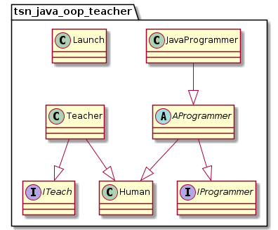
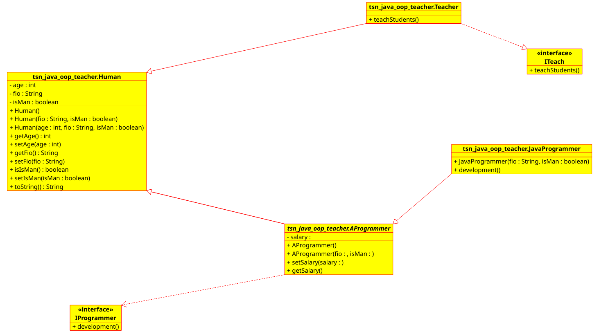

# TSN_JAVA_OOP_TEACHER

Пример ООП с несколькими классами на Java для NetBeans

[Крутая javadoc к этому проекту](https://tsnsoft.github.io/TSN_JAVA_OOP_TEACHER)

* Создать в NetBeans заготовки документации:
**Сервис -> Анализ документации Javadoc**

* Создать в NetBeans готовую документацию после редактирования заготовок:
**Сервис -> Выполнить -> Создать документацю Java**
