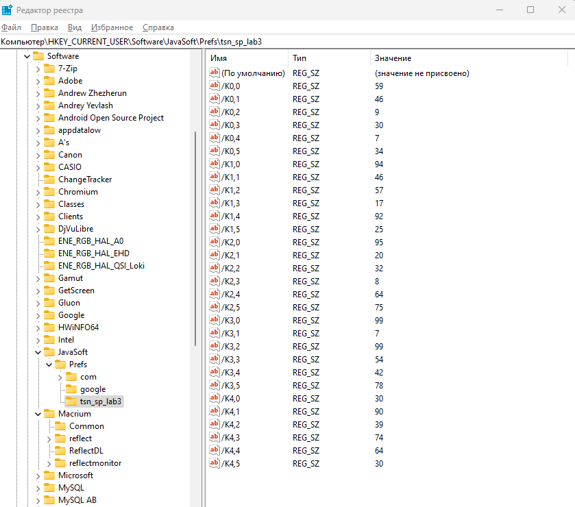

# TSN_JAVA_Preferences_matrix
Пример работы с Preferences на Java в NetBeans

```
Laboratory work
Task: MAX <> MIN
Matrix:
-5 3 -6 -3 1 -9 
-9 6 4 5 7 -6 
1 -3 10 3 -6 3 
2 0 3 4 0 0 
8 -7 2 -9 10 -10 
New matrix:
-5 3 -6 -3 1 -9 
-9 6 4 5 7 -6 
1 -3 -10 3 -6 3 
2 0 3 4 0 0 
8 -7 2 -9 10 10 
```

