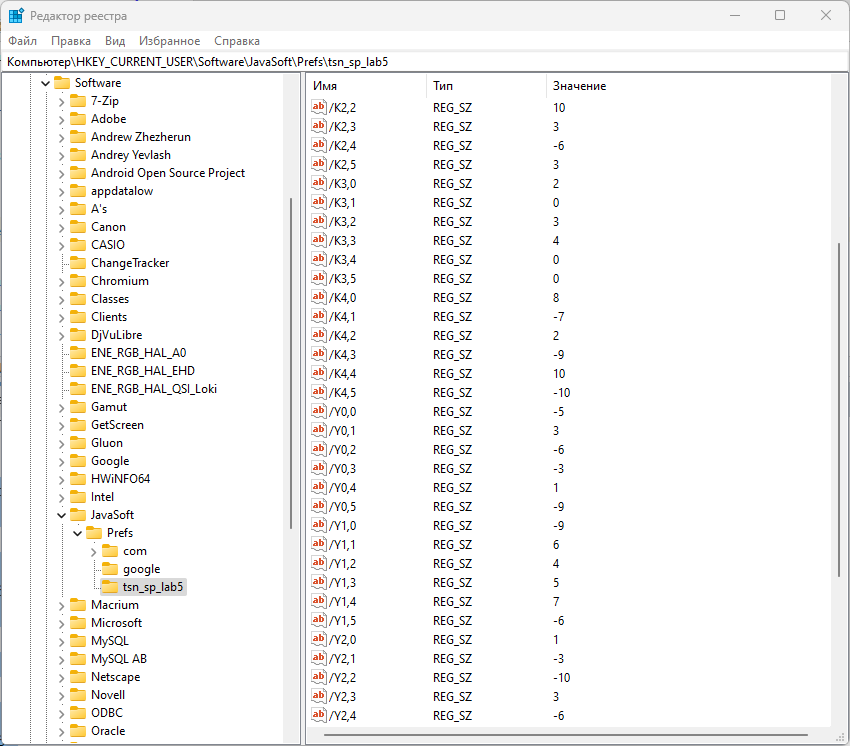

# TSN_JAVA_Preferences_matrix
Пример работы с Preferences на Java в NetBeans

```
Laboratory work
Task: MAX <> MIN
Matrix:
59 46 9 30 99 34 
94 46 57 17 92 25 
95 20 32 8 64 75 
7 7 99 54 42 78 
30 90 39 74 64 30 
New matrix:
59 46 9 30 7 34 
94 46 57 17 92 25 
95 20 32 8 64 75 
99 7 99 54 42 78 
30 90 39 74 64 30 
```

